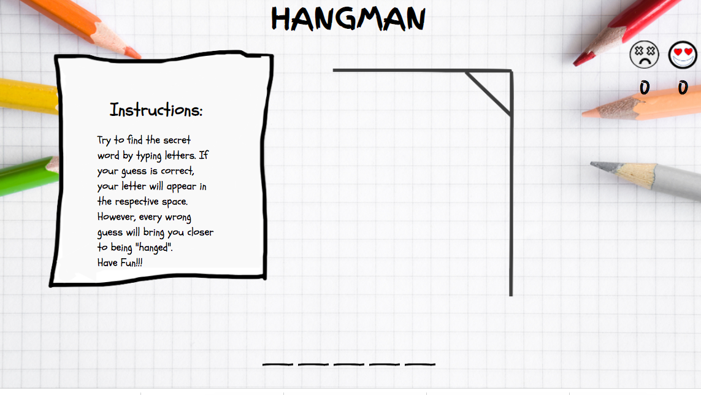
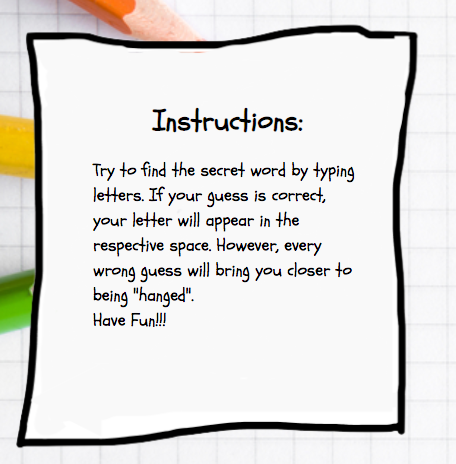
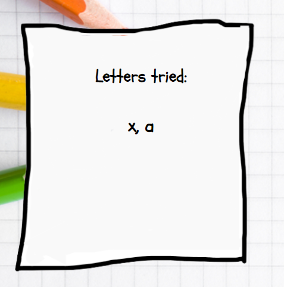
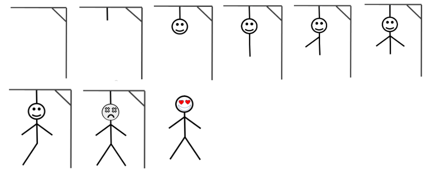
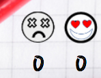
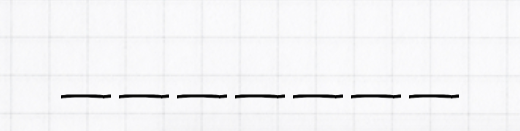
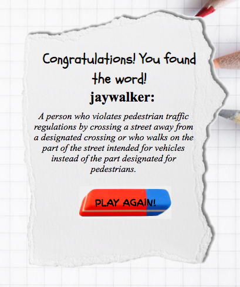
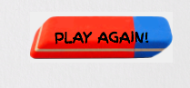
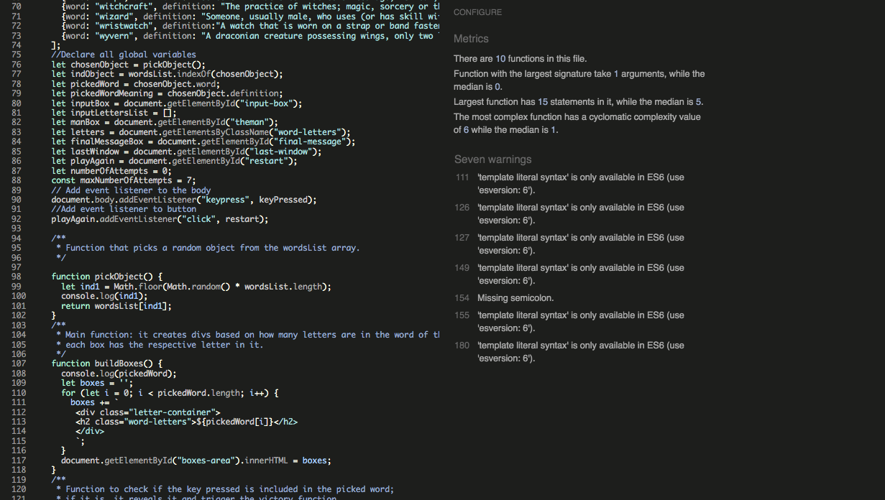

# HANGMAN
[View the live project here]()

Hangman is a classic word game. This game is a fun way of learning vocabulary, and it's especially useful for remembering the spelling of new words.  
The website's goal is to provide a challenging, educational game to entertain the online user. 
Hangman's target is adults looking for a short game with no long-term commitments, something familiar that brings back memories of the good old days, and young adults keen to learn new words in a fun way.  

##FEATURES:

### The Landing Page
 
- The page landing includes a background image with all the other features overlaid to allow the user to see the content of the site.

### The Instructions

- In this section, the user has an explanation of how the game works.
- This section will desappear when the game starts leaving room for the Input section.

### The Input Board

- This section appears when the user types its first guessed letter, and it keeps adding each letter typed.
- This part is a reminder of the letters typed, and it helps the user to proceed with the game without making the same mistakes.

### The Hangman

- This section changes the background every time the user types the wrong letter building the "hangman"; when the hangman is complete, the game is over, and the user loses. However, if the user guesses the word before then, it will display the victory background image.
- From this feature, the user can see how close he/she is to lose the game.

### The Score

- The score will update every time the game is over: if the user wins, the score under the happy face will increase by 1; if the user loses, the score under the sad face will increase by 1.
- From this feature, the user can see how many games have been lost or won.

### The Underscores

- This section generates every time the game is loaded. Every underscore represents a letter of the chosen word. When the user guesses the correct letter, it gets displayed in the respective space.
- From this feature, the user can see how long the word is and, through correct guessings,  the letter's position. This section helps the user to win the game.

### The Final Message

- This section pops up when the game is over. If the user wins, it shows a message of congratulations, otherwise of encouragement. Either way, below the statement, it displays the secret word, its definition, and the "play again!" button.
- This section acknowledges the user of the game's result and enriches the user's vocabulary by defining the meaning of the word that could have been previously unknown. 

### The "Play Again!" Button

- This clickable button restarts the game without affecting the scores.
It resets the hangman, the input section, and along with the word, it updates the underscore section.
- This button is displayed when the game is over and allows the user to play again.

## Testing:
Testing: 
- The project has been tested on different browsers to ensure the website functions correctly, and the results are satisfactory in Chrome, Safari, Opera, and Firefox. 
- I can confirm that the website is responsive after going through all the standard portals available in dev tools. 
<table>
<thead>
<tr>
<th>Action or Happening</th>
<th>Expected Result</th>
<th>Successful?<th>
</tr>
</thead>
<tbody>
<tr>
<td>Click on website url</td>
<td>Open the landing page</td>
<td>Yes</td>
</tr>
<tr>
<td>Type any key</td>
<td>Key appears in the input window</td>
<td>Yes</td>
</tr>
<tr>
<td>Type any key</td>
<td>If the secret word includes the key, it appears in its space</td>
<td>Yes</td>
</tr>
<tr>
<td>Type any key</td>
<td>If the secret word does not include the key, start to build the hangman</td>
<td>Yes</td>
</tr>
<tr>
<td>The user loses the game</td>
<td>Show the final message and play again button</td>
<td>Yes</td>
</tr>
<tr>
<td>The user loses the game</td>
<td>Increase the lost game score</td>
<td>Yes</td>
</tr>
<tr>
<td>The user wins the game</td>
<td>Show the final message and the play again button</td>
<td>Yes</td>
</tr>
<td>The user wins the game</td>
<td>Increase the won game score</td>
<td>Yes</td>
</tr>
<tr>
<td>The game is over</td>
<td>Remove the object containing the word from the list of candidates for the next game</td>
<td>Yes</td>
</tr>
<tr>
<td>The game is over</td>
<td>Stop taking any key</td>
<td>Yes</td>
</tr>
<tr>
<td>Click on the play again button</td>
<td>Start a new game</td>
<td>Yes</td>
</tr>
<tr>
</tbody>
</table>

- All the pages went through Lighthouse in dev tools, giving positive results for readability, color contrast, and accessibility:

### Validator Testing:
- HTML
No errors were returned when passing through the official [W3C validator]();
- CSS
No errors were found when passing through the official [(Jigsaw) validator]();
- JSHint
No errors were found when passing through the official [(JSHint) validator](), 
even though some warning messages have been detected due to the usage of 'template literal syntax'.

## Bugs:
Sometimes, when opening the website on the browser, the footer background image and the main image on the sign-up page wouldn’t load properly.

I then tried reducing the size through a compression tool and changed the format from jpg to webp.
The drastic size reduction corrected the issue and bettered the performance of the page.

## Deployment:
The site was deployed to GitHub pages. The steps to deploy are as follows:
- In the GitHub repository, navigate to the Settings tab;
- On the menu on the left, under Code and Automation, click on Pages;
- From the source section drop-down menu, select the Main Branch;
- Once the main branch has been selected, click on Save;
- At the top of the page will then appear the message “Your site is ready to be published at” and the URL;
- Refresh the page, and the message will change to “Your site is published at” and the active URL.
- The live link can be found here - 

### Local Deployment:
To work on the code from a local device, the steps to clone the repository are as follows:
- In the GitHub repository click the Code button above the list of files;
- Copy the URL displayed on the clone tab;
- Open the terminal on your device;
- Type git clone and paste the URL copied earlier;
- Press enter.

## Credit:
Some of the structure and contents for the README.md file were taken from the Tastes Of Autumn project.

### Media
The images were taken from:
- [Shutterstock](https://www.shutterstock.com/image-photo/wooden-color-pencils-on-white-paper-1005954823) for the body background;
- [Shutterstock](https://www.shutterstock.com/image-photo/close-white-ripped-piece-paper-on-226006654) for the final message background;
- [Pexels](https://www.pexels.com/it-it/foto/gomma-da-cancellare-pelikan-br-40-rossa-e-blu-su-superficie-bianca-35202/) for the play again button;
- The developer drew the background images of the hangman.
- The screenshot of the website on different ports was from [Mockup screen generator](https://ui.dev/amiresponsive);
- The fonts were taken from [Google Fonts](https://fonts.google.com/);
- The favicons was generated and taken from [Faviocon](https://favicon.io/)];
- The words were taken from a list in [hangmanwords](https://www.hangmanwords.com/words)
- The words definitions were taken from [Wictionary](https://en.wiktionary.org/wiki/Wiktionary:Main_Page).
- The body background image was compressed in [Tinyjpg](https://tinyjpg.com/);